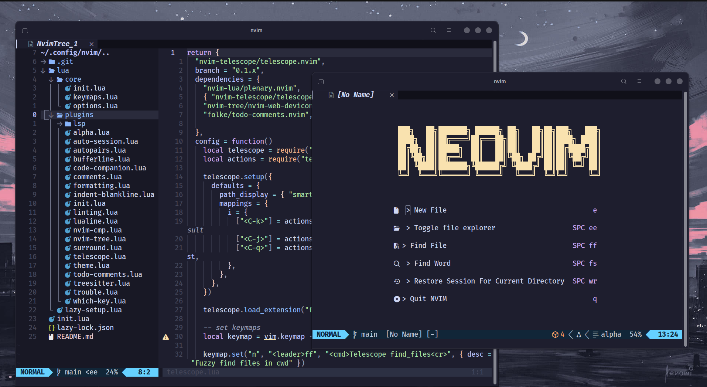

<a name="readme-top"></a>

<br />
<div align="center">
  <a href="#">
    
  </a>
  <h3 align="center">Neovim IDE setup</h3>

  <p align="center">
    Custom setup of Neovim IDE from scratch.
    <br />
    <br />
    <a href="https://github.com/pallandir/neovim/issues">Report Bug</a>
    ·
    <a href="https://github.com/pallandir/neovim/issues">Request Feature</a>
  </p>
</div>
<br>
<br>


## About this project

After six years of using `VSCode`, I decided to switch to `Neovim`. I found traditional IDEs to be overly bloated, packed with every possible tool, often sluggish, and with a minimal learning curve that didn’t challenge or engage me.

In contrast, learning and configuring Vim felt rewarding. It offers a streamlined and efficient development experience that’s both powerful and enjoyable. I initially experimented with `NVChad`, but eventually moved away from it to build my own setup from scratch. This hands-on approach helped me deeply understand how `Neovim` works under the hood.

This project is the result: a fully customized, lightweight IDE tailored to my workflow, with only the essential plugins. It supports Vue.js, Python, Go, Rust, and OpenTofu for a fast and focused development environment. It also includes OpenCode AI integration for AI-assisted coding directly within Neovim.

<p align="right">(<a href="#readme-top">back to top</a>)</p>

## Getting Started

Getting up and running with this custom Neovim setup is simple. Just clone the repository into your Neovim config directory:

```sh
git clone git@github.com:pallandir/neovim.git ~/.config/nvim
```

If you plan to make changes and use your own version, you can either update the remote to point to your repository or remove the .git directory entirely to start fresh:

```sh
git remote set-url origin <your-remote-url>
# or
rm -rf ~/.config/nvim/.git
```

> [!tip]
> Package manager: `Lazy.nvim`
>
> - `:Lazy` (to open the Lazy interface)
>
> LSP manager: `Mason.nvim`
>
> - `:Mason` (to open Mason imterface)
> - `:MasonInstall` \<lsp> to install a specific lsp

<p align="right">(<a href="#readme-top">back to top</a>)</p>

## Custom keymap

> [!important]
> In this config `<leader> = space`

### General keys

| Command      | Description                                        |
| ------------ | -------------------------------------------------- |
| `jk`         | Exit insert mode                                   |
| `<leader>nh` | Clear search highligh (:nohl)                      |
| `<leader>+`  | Increment selected number                          |
| `<leader>-`  | Decrement selected number                          |
| `<leader>sv` | Split window vertically                            |
| `<leader>sh` | Split window horizontally                          |
| `<leader>se` | Split window equally when they are inequally sized |
| `<leader>sx` | Close current split                                |
| `<leader>to` | Open new tab                                       |
| `<leader>tx` | Close new tab                                      |
| `<leader>tn` | Go to next tab                                     |
| `<leader>tp` | Go to previous tab                                 |
| `<leader>tf` | Open current buffer in a new tab                   |

### Terminal

| Command      | Description                                 |
| ------------ | ------------------------------------------- |
| `<leader>th` | Toggle horizontal terminal (40% height)     |
| `<leader>oo` | Toggle OpenCode AI terminal (40% width)     |

### File explorer ([nvim-tree](https://github.com/nvim-tree/nvim-tree.lua))

| Command      | Description                          |
| ------------ | ------------------------------------ |
| `<leader>nn` | Toggle file explorer                 |
| `<leader>nf` | Toggle file explorer on current file |
| `<leader>nc` | Collapse file explorer               |
| `<leader>nr` | Refresh file explorer                |

### Session management ([persistence.nvim](https://github.com/folke/persistence.nvim))

| Command      | Description          |
| ------------ | -------------------- |
| `<leader>wr` | Restore session      |
| `<leader>ws` | Select session       |
| `<leader>wl` | Restore last session |
| `<leader>wd` | Stop persistence     |

### Find files and grep ([fzf-lua](https://github.com/ibhagwan/fzf-lua))

| Command      | Description                  |
| ------------ | ---------------------------- |
| `<leader>ff` | Find files                   |
| `<leader>fr` | Recent files                 |
| `<leader>fs` | Live grep                    |
| `<leader>fc` | Grep word under cursor       |
| `<leader>fb` | Find buffers                 |
| `<leader>fh` | Help tags                    |
| `<leader>fk` | Keymaps                      |
| `<leader>fd` | Document diagnostics         |
| `<leader>fD` | Workspace diagnostics        |

> [!tip]
> While in fzf-lua, use `Alt+i` to toggle ignored files and `Alt+h` to toggle hidden files.

### Errors management ([trouble.nvim](https://github.com/folke/trouble.nvim))

| Command      | Description                        |
| ------------ | ---------------------------------- |
| `<leader>xw` | Open trouble workspace diagnostics |
| `<leader>xd` | Open trouble document diagnostics  |
| `<leader>xq` | Open trouble quickfix list         |
| `<leader>xl` | Open trouble location list         |
| `<leader>xt` | Open todos in trouble              |

### Formatting and linting ([conform.nvim](https://github.com/stevearc/conform.nvim) | [nvim-lint](https://github.com/mfussenegger/nvim-lint))

| Command      | Description                       |
| ------------ | --------------------------------- |
| `:w`         | Automatic format and lint on save |
| `<leader>mp` | Manual file formatting            |
| `<leader>l`  | Manual file linting               |

### Autocomplete ([nvim-cmp](https://github.com/hrsh7th/nvim-cmp))

> Auto complete is configured to directly integrates with buffer context, file system, code snippets and custom lsp config. As long as you defined a snippet tool (i.e rust-analyser for Rust) for your custom lsp it will automatically be taken into account.

| Command        | Description                        |
| -------------- | ---------------------------------- |
| `<C-k>`        | Select previous item in suggestion |
| `<C-j>`        | Select next item in suggestion     |
| `<C-b>`        | Scroll docs (up)                   |
| `<C-f>`        | Scroll docs (down)                 |
| `<C-Space>`    | Enable suggestions                 |
| `<C-e>`        | Abort sugestions                   |
| `<CR>` (enter) | Confirm selection                  |

### LSP ([nvim-lspconfig](https://github.com/neovim/nvim-lspconfig))

> LSP server is configured to support documentation from mutliple sources. For now this config supports rust, golang, python, vue.js, typescript and openTofu / terraform.

| Command      | Description                                |
| ------------ | ------------------------------------------ |
| `<K>`        | Read documentation of current hovered item |
| `<leader>rn` | Smart rename of current item               |
| `<leader>rs` | Restart LSP server                         |
| `<gd>`       | Show LSP definitions                       |
| `<gi>`       | Show LSP implementation                    |

### OpenCode AI ([opencode.nvim](https://github.com/sudo-tee/opencode.nvim))

> OpenCode provides AI-assisted coding capabilities directly within Neovim. Use the plugin interface for a dedicated panel or the terminal integration for the full CLI experience.

| Command      | Description                                |
| ------------ | ------------------------------------------ |
| `<leader>og` | Toggle OpenCode plugin panel               |
| `<leader>oi` | OpenCode input prompt                      |
| `<leader>od` | View OpenCode diffs                        |
| `<leader>oo` | Toggle OpenCode in terminal split          |

## Tmux Integration

This config is designed to work alongside tmux with the shared configuration from the dotfiles repository. The tmux config includes:

- **Prefix**: `Ctrl+a` (instead of default `Ctrl+b`)
- **Catppuccin Mocha** theme for visual consistency
- **Session persistence** via tmux-resurrect and tmux-continuum
- **Vim-style navigation** with `h/j/k/l` keys

### Tmux Keybindings

| Command      | Description                     |
| ------------ | ------------------------------- |
| `prefix + o` | Open OpenCode in vertical pane  |
| `prefix + \|`| Vertical split (current path)   |
| `prefix + -` | Horizontal split (current path) |
| `prefix + h` | Navigate pane left              |
| `prefix + j` | Navigate pane down              |
| `prefix + k` | Navigate pane up                |
| `prefix + l` | Navigate pane right             |
| `prefix + I` | Install TPM plugins             |

> [!tip]
> After first tmux launch, press `prefix + I` to install all plugins including the Catppuccin theme.

## License

This repository and all its content is under `GNU General Public License v3.0`.

<p align="right">(<a href="#readme-top">back to top</a>)</p>
